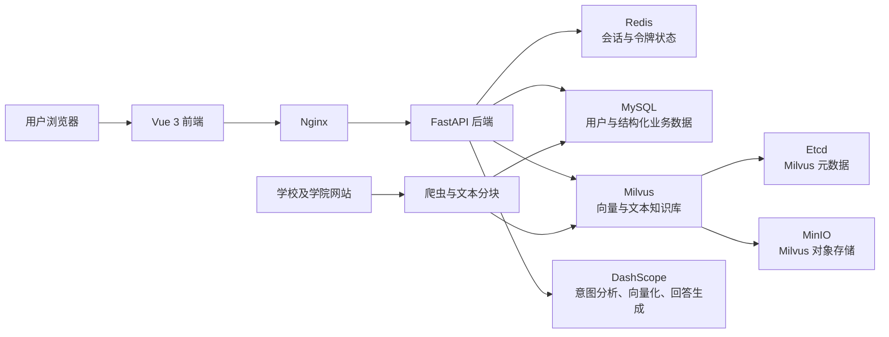
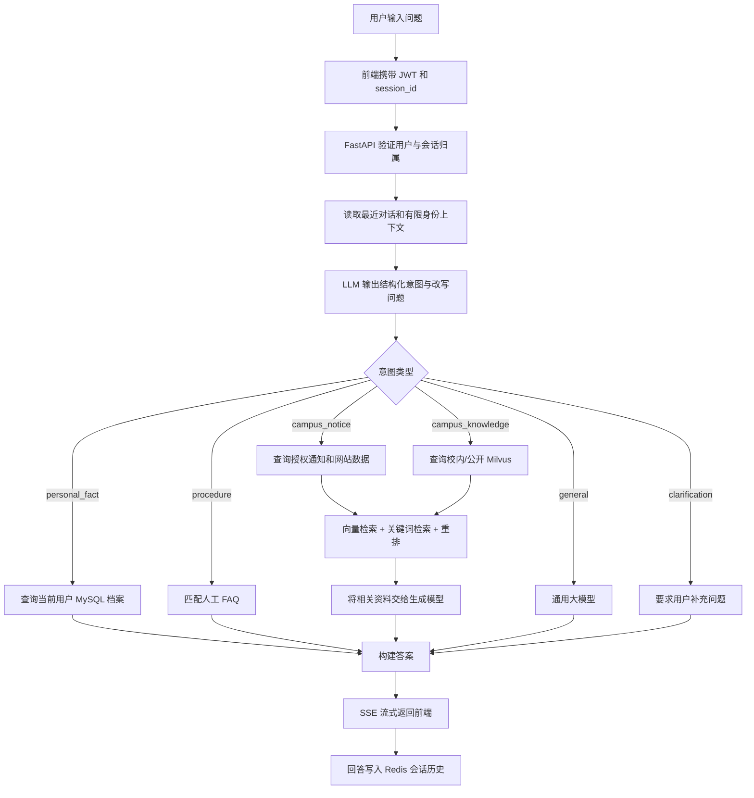
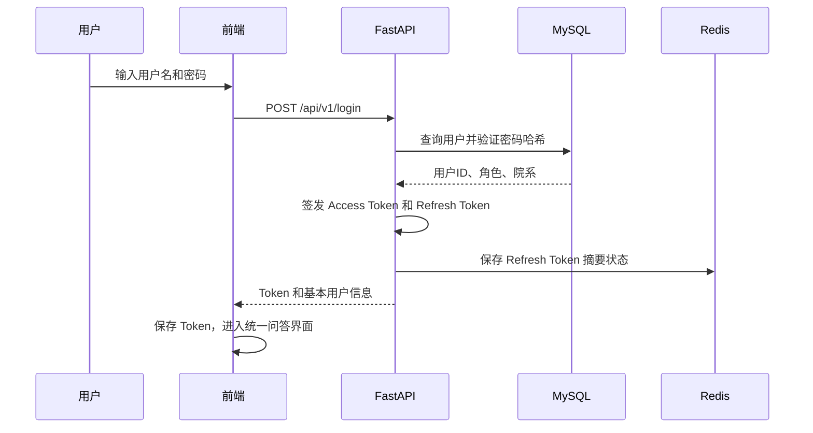
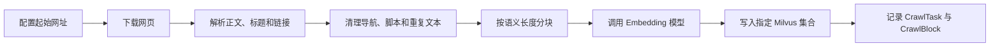
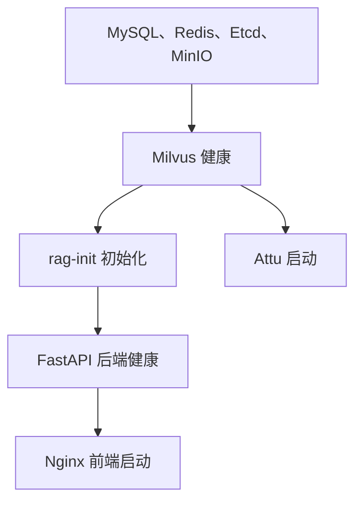

# SynapseQ 同济大学 AI 校园问答系统项目讲解

> 本文档面向项目答辩、系统演示和技术说明，内容以当前代码和当前 Docker
> 运行环境为准。重点解释系统的工作方法、问答工作流、权限控制、数据组织方式
> 以及 RAG 检索流程。
>
> 当前版本核对日期：2026 年 6 月 14 日

## 1. 项目概述

### 1.1 项目名称

SynapseQ 同济大学 AI 校园问答系统。

### 1.2 项目要解决的问题

传统校园信息查询通常存在以下问题：

1. 信息分散在学校官网、学院官网、教务系统、通知公告和个人系统中。
2. 学校网站页面较多，用户很难快速定位准确页面。
3. 普通大模型不了解学生本人绩点、课表等私有数据。
4. 直接使用大模型容易产生幻觉，回答可能没有学校数据作为依据。
5. 公开信息、校内信息和个人信息具有不同的访问权限，不能混在一起检索。
6. 关键词规则难以理解问题真正的含义。例如，“我的学院是什么”和
   “我的学院成立于哪一年”虽然都包含“我的学院”，但前者查询个人档案，
   后者查询学院历史。

SynapseQ 的目标是建立一个统一的自然语言入口，让系统自动识别用户身份和问题
意图，再从正确的数据源中查询答案。

### 1.3 当前系统定位

当前系统是一个面向同济大学校园场景的身份感知 RAG 问答系统，具有以下能力：

- 访客可以查询公开学校信息。
- 学生和教师可以查询公开信息及校内爬取信息。
- 登录用户可以查询自己的个人档案、绩点、课表和课程成绩。
- 学生和教师可以查看符合本人院系和身份范围的通知。
- 常见问题可以直接命中人工 FAQ，减少模型调用。
- 数据库存在答案时优先基于数据库回答。
- 数据库没有答案时，才使用通用大模型知识进行补充。
- DashScope 或向量服务不可用时，仍能通过本地规则和关键词检索降级运行。

## 2. 核心设计思想

本项目的核心不是简单地“把文档交给大模型”，而是让大模型、结构化数据库、
向量数据库和权限系统分别承担适合自己的任务。

### 2.1 统一入口

前端不再允许用户手动选择“公开、校内、个人”等模块。所有问题都通过统一的
`auto` 问答入口提交。

这样设计的原因是：

- 普通用户不需要理解数据存在哪个数据库。
- 用户不容易因为选错模块而查询不到已有信息。
- 权限判断由后端完成，不能依赖前端按钮。
- 系统可以根据问题语义动态选择数据源。

### 2.2 LLM 先分析，再选择检索路线

每个问题进入后端后，系统首先尝试让 LLM 输出结构化的路由结果，而不是先用
“是否包含绩点、学院、课表”等关键词直接返回数据。

路由结果包含：

```json
{
  "intent": "campus_knowledge",
  "rewritten_query": "同济大学计算机科学与技术学院成立于哪一年",
  "personal_field": null,
  "confidence": 0.95
}
```

当前支持的意图包括：

| 意图 | 含义 | 主要数据源 |
| --- | --- | --- |
| `personal_fact` | 查询当前用户个人字段值 | MySQL、个人向量 |
| `procedure` | 查询办理方法、入口、步骤和规则 | 人工 FAQ、FAQ 向量库 |
| `campus_knowledge` | 查询学校、学院、专业等实体知识 | 校内或公开知识库 |
| `campus_notice` | 查询新闻、通知和公告 | 结构化通知、网站爬取数据 |
| `general` | 与已有校园数据库无直接关系的问题 | 通用大模型 |
| `clarification` | 问题过短或目标不明确 | 返回追问提示 |

### 2.3 结构化数据和非结构化知识分开存储

项目没有把所有数据都塞进向量数据库。

- 精确、经常变化且带有明确字段的数据存入 MySQL。
- 网站文章、新闻、学院介绍等长文本存入 Milvus。
- 会话历史和刷新令牌状态存入 Redis。
- Milvus 的对象存储和元数据依赖 MinIO 与 Etcd。

这种设计可以避免使用模糊的向量相似度查询精确绩点，也可以避免使用关系数据库
处理大量网页自然语言文本。

### 2.4 身份决定可检索范围

用户不能通过修改前端页面来获得额外权限。后端会根据 JWT 中的用户 ID重新查询
MySQL，并以数据库中的实际角色和院系为准。

| 身份 | 可查询范围 |
| --- | --- |
| 访客 | 公开知识、公开 FAQ |
| 学生 | 公开知识、校内知识、本人档案、本人课表、本人课程成绩、授权通知 |
| 教师 | 公开知识、校内知识、本人教师档案、本人授课安排、授权通知 |

系统目前没有访问学者身份。原访问学者账号和相关冗余数据已经移除。

## 3. 系统总体架构



### 3.1 前端层

前端使用：

- Vue 3
- Vite
- Tailwind CSS
- Nginx

前端主要负责：

- 登录和访客进入。
- 会话列表与历史消息展示。
- 发送问题。
- 读取 SSE 流并逐步显示回答。
- 展示当前用户身份、可访问知识范围和常用校园服务。

前端不会决定用户能够访问哪些真实数据，权限以 FastAPI 后端判断为准。

### 3.2 后端服务层

后端使用 FastAPI，主要负责：

- 用户登录、JWT 签发和刷新。
- 用户身份与权限校验。
- 会话创建、删除和历史读取。
- LLM 问题意图分析。
- 个人结构化数据查询。
- FAQ、Milvus 和通知检索。
- RAG Prompt 构建与答案生成。
- SSE 流式响应。

### 3.3 数据层

| 组件 | 主要职责 |
| --- | --- |
| MySQL | 用户、学生档案、教师档案、课表、成绩、通知、爬虫任务 |
| Milvus | 公开知识、校内知识、FAQ、兼容个人文本 |
| Redis | 会话元数据、聊天历史、Refresh Token 状态、访客限流 |
| MinIO | Milvus 使用的对象存储 |
| Etcd | Milvus 使用的元数据与协调服务 |

### 3.4 当前模型配置

| 任务 | 当前模型 | 配置特点 |
| --- | --- | --- |
| 问题意图分析和改写 | `qwen-flash` | 温度 0.2，输出结构化路由 JSON |
| 最终回答生成 | `qwen3-max` | 温度 0，开启流式输出 |
| 文本向量化 | `text-embedding-v4` | 生成 1024 维向量 |

生成模型设置低温度是为了提高校园事实回答的稳定性。意图分析允许少量灵活性，
但程序会校验输出 JSON、意图取值和敏感个人路径，模型不能任意指定后端操作。

## 4. 一次完整问答的工作流

这是答辩时最重要的部分。



### 4.1 第一阶段：前端发送请求

前端发送：

```http
POST /api/v1/chat/auto
Authorization: Bearer <access_token>
Content-Type: application/json
```

请求体：

```json
{
  "query": "我的学院成立于哪一年？",
  "session_id": "当前会话ID",
  "stream": true
}
```

### 4.2 第二阶段：身份和会话校验

后端先完成以下检查：

1. 验证 JWT 签名和有效期。
2. 确认令牌类型为 Access Token。
3. 从 `sub` 字段读取用户 ID。
4. 使用用户 ID 重新查询 MySQL。
5. 确认账号存在、已启用且角色为学生或教师。
6. 验证当前会话确实属于当前用户。
7. 验证会话类型为 `auto`。

因此，即使用户修改前端请求中的显示身份，也不能伪装成其他用户。

### 4.3 第三阶段：获取路由上下文

系统不会在意图分析阶段把完整个人档案交给模型，只读取完成指代消解所需的有限
信息，例如：

```json
{
  "role": "student",
  "dept_id": "CS",
  "college_name": "计算机系",
  "major": null
}
```

这一步的目的是理解“我的学院”“我的专业”等表达，而不是直接生成最终答案。

### 4.4 第四阶段：LLM 意图分析

系统结合以下内容分析问题：

- 当前问题。
- 最近最多 6 条会话消息。
- 当前角色。
- 有限的院系和专业上下文。

LLM 只能从规定的意图类型中选择，并输出 JSON。

例如：

| 用户问题 | 正确意图 | 处理方式 |
| --- | --- | --- |
| 我的绩点是多少？ | `personal_fact` | 查询本人 GPA |
| 如何查询绩点？ | `procedure` | 查询 FAQ |
| 我的学院是什么？ | `personal_fact` | 查询本人学院字段 |
| 我的学院成立于哪一年？ | `campus_knowledge` | 先解析具体学院，再查学院历史 |
| 计算机学院最近有什么通知？ | `campus_notice` | 查询师生可见校内内容 |
| 学院 | `clarification` | 询问用户想查询学院哪方面 |

这解决了早期“只要包含绩点就返回绩点”“只要包含学院就返回 CS”的问题。

### 4.5 第五阶段：个人信息路径

只有 `intent=personal_fact` 才允许读取个人数据。

个人数据查询流程：

1. 根据 JWT 对应的 `users.id` 查询当前用户。
2. 学生读取 `student_profiles`。
3. 教师读取 `teacher_profiles`。
4. 课表读取 `course_schedules`。
5. 学生成绩读取 `student_grades`。
6. 如需兼容旧数据，再使用相同 `user_id` 过滤 `rag_person_info`。

个人向量过滤条件示例：

```text
user_id == '4'
```

系统不接受前端传入一个任意 `user_id` 来查询个人信息。

如果问题明确提到其他用户，例如登录 Lee 后询问“张三的绩点是多少”，后端会拒绝
返回并提示只能查询当前账户。

### 4.6 第六阶段：FAQ 路径

FAQ 有两层匹配：

1. 本地人工 FAQ 匹配。
2. Milvus 中 `rag_faq` 的语义检索。

本地 FAQ 的优点：

- 不需要调用外部模型。
- 响应快。
- 答案稳定。
- 适合教务入口、校园卡、校园网、访客预约等固定问题。

FAQ 的唯一维护源是：

```text
backend/app/manual_faqs.py
```

Docker 初始化或手动同步时，数据库会严格镜像该文件：

- 文件中新增加的问题会写入数据库。
- 修改的问题会更新。
- 从文件中删除的问题也会从 FAQ 集合删除。

### 4.7 第七阶段：校园知识路径

当问题属于学校、学院、专业、新闻等校园知识时，系统根据身份决定检索集合。

访客：

```text
rag_standard
```

学生和教师：

```text
rag_standard + rag_knowledge
```

如果问题中的“我的学院”已经根据身份被改写为具体学院，则系统会优先查询
`rag_knowledge`，避免公开百科中的相似内容抢占学院官网结果。

例如：

```text
原问题：我的学院成立于哪一年？
身份上下文：CS，计算机系
改写问题：同济大学计算机科学与技术学院成立于哪一年？
优先集合：rag_knowledge
```

### 4.8 第八阶段：混合检索与重排

Milvus 检索不是只依赖单一向量距离。

正常情况下：

1. 使用 DashScope `text-embedding-v4` 将问题转为 1024 维向量。
2. 在允许访问的 Milvus 集合中执行 COSINE 相似度搜索。
3. 同时使用 Jieba 对问题分词。
4. 在 Milvus 文本字段中执行关键词覆盖匹配。
5. 合并向量结果和关键词结果。
6. 去重。
7. 根据相似度和关键词相关性重排。
8. 选取最终上下文交给生成模型。

这种方法兼顾：

- 向量检索对同义表达的理解能力。
- 关键词检索对人名、年份、学院名称等精确词的识别能力。

### 4.9 第九阶段：生成答案

如果检索到相关文档，系统会把以下内容发送给生成模型：

- 用户问题。
- 检索得到的文档片段。
- 每个片段的来源。
- 校园问答约束 Prompt。

模型需要基于检索资料回答，不能把没有证据的内容当作学校事实。

如果没有检索到相关文档，则进入通用回答路径。

### 4.10 第十阶段：流式返回和保存历史

后端使用 SSE 返回：

```text
data: {"chunk": "回答片段"}

data: {"chunk": "下一个回答片段"}

data: [DONE]
```

前端逐块读取并显示内容，因此用户不需要等待整个答案生成完成。

回答结束后，用户问题和 AI 回答都会写入 Redis，用于：

- 前端恢复历史对话。
- 下一轮问题的指代消解。
- 会话列表和标题展示。

## 5. 为什么不能只用关键词规则

早期规则可能写成：

```text
问题包含“绩点” -> 返回当前绩点
问题包含“学院” -> 返回当前学院
```

这种做法会产生明显错误：

| 问题 | 错误的关键词结果 | 实际需求 |
| --- | --- | --- |
| 如何查询绩点？ | 返回 3.85 | 返回查询方法 |
| 我的学院成立于哪一年？ | 返回 CS | 查询学院历史 |
| 我的专业就业情况如何？ | 返回专业名称 | 查询该专业就业信息 |
| 学院 | 随机命中学院信息 | 应先追问具体需求 |

当前方案采用：

```text
LLM 语义路由 -> 严格的数据权限 -> 对应的数据检索
```

关键词规则只作为 LLM 服务异常时的保守降级方式，而且规则明确区分：

- 个人字段值。
- 查询方法。
- 所属实体的属性。
- 通知和新闻。
- 模糊问题。

## 6. LLM 不可用时的降级机制

本项目将可用性作为重要目标。DashScope 连接失败时不会让整个系统完全不可用。

### 6.1 路由降级

LLM 意图分析失败时，系统使用本地保守语义规则：

- 包含“如何、怎么、入口、办理流程”等，路由到 `procedure`。
- 询问“我的绩点是多少”，路由到个人字段。
- 询问“我的学院成立、历史、介绍、院长”等，路由到校园知识。
- 问题只有“学院、专业、课程、成绩”等短词时，要求补充信息。

### 6.2 检索降级

Embedding 服务失败时：

- 不执行远程向量化。
- 直接读取 Milvus 文本字段。
- 使用 Jieba 分词和关键词覆盖率计算相关度。

### 6.3 生成降级

生成模型失败但数据库已经命中资料时：

- 系统提取与问题最相关的句子。
- 优先保留年份、学院全称、成立信息等关键内容。
- 返回资料摘要和来源。

例如当前问题“我的学院成立于哪一年”即使生成模型不可用，也能从学院官网数据中
提取：

```text
2024 年 7 月 19 日，同济大学成立计算机科学与技术学院……
```

如果数据库也没有命中，则返回统一的服务不可用提示，而不是把内部异常堆栈直接
暴露给用户。

## 7. 身份认证与权限工作流

### 7.1 登录流程



### 7.2 JWT 的作用

Access Token 中包含：

- `sub`：用户 ID。
- `role`：签发时角色。
- `dept`：签发时院系。
- `type`：令牌类型。
- `exp`：过期时间。

但在每次请求中，后端仍会根据 `sub` 查询 MySQL，以数据库中的当前角色、院系和
启用状态为准。这可以避免用户权限变化后仍长期使用旧令牌声明。

### 7.3 Refresh Token

Refresh Token 用于 Access Token 过期后的续期。

项目不会直接使用完整 Refresh Token 作为 Redis Key，而是先计算 SHA-256 摘要，
减少敏感令牌直接出现在 Redis Key 和运维工具中的风险。

### 7.4 访客机制

访客登录会生成：

```text
guest_<UUID>
```

访客同样拥有临时会话，但：

- 不能读取个人档案。
- 不能读取校内知识集合。
- 不能访问结构化通知接口。
- 每分钟最多发起 10 次问答请求。

### 7.5 会话隔离

Redis 使用：

```text
user_sessions:<user_id>
chat_history:<session_id>
```

后端在读取、删除或继续会话前会检查会话是否属于当前用户，防止通过猜测
`session_id` 读取他人的历史记录。

## 8. MySQL 数据模型

### 8.1 用户表 `users`

存储：

- 用户 ID。
- 用户名。
- 密码哈希。
- 姓名。
- 角色。
- 院系代码。
- 启用状态。

密码在数据库中保存为哈希值，不保存明文。

### 8.2 学生档案 `student_profiles`

主要字段：

- 学号。
- 学院或系。
- 专业。
- 年级。
- 班级。
- 当前 GPA。
- 专业排名。
- 已获学分。
- 校区。

### 8.3 教师档案 `teacher_profiles`

主要字段：

- 工号。
- 学院或系。
- 职称。
- 办公室。
- 研究方向。
- 校区。

### 8.4 课表 `course_schedules`

学生和教师均可使用，主要字段：

- 学期。
- 课程号。
- 课程名。
- 任课教师。
- 星期。
- 起止节次。
- 开始时间和结束时间。
- 地点。
- 周次。
- 课程状态。

### 8.5 学生成绩 `student_grades`

主要字段：

- 学期。
- 课程号。
- 课程名。
- 成绩。
- 课程绩点。
- 学分。

### 8.6 校园通知 `campus_notices`

主要字段：

- 标题和正文。
- 院系代码。
- 受众：`all`、`student` 或 `teacher`。
- 来源。
- 发布时间。
- 失效时间。
- 启用状态。

通知查询使用双重过滤：

```text
院系匹配 + 受众身份匹配
```

例如，一个 `dept_id=CS` 且 `audience=teacher` 的通知，CS 学生仍然不能查看。

### 8.7 爬虫记录

`crawl_tasks` 保存爬取任务状态和统计信息。

`crawl_blocks` 保存网页分块、来源 URL、文本预览和对应 Milvus ID，便于追踪一条
向量数据来自哪个页面。

## 9. Milvus 向量库设计

当前共有 5 个集合：

| 集合 | 当前记录数 | 用途 | 访问范围 |
| --- | ---: | --- | --- |
| `rag_standard` | 502 | 百科、学校官网等公开知识 | 所有人 |
| `rag_knowledge` | 260 | 学院官网、校内爬取知识 | 学生、教师 |
| `rag_faq` | 51 | 人工 FAQ | 所有人 |
| `rag_internal` | 2 | 旧版内部演示文本 | 学生、教师 |
| `rag_person_info` | 3 | 旧版个人向量兼容数据 | 仅当前用户 |
| **合计** | **818** | - | - |

### 9.1 为什么个人信息主要放 MySQL

绩点、学号和课表具有明确字段，MySQL 能提供：

- 精确查询。
- 明确用户归属。
- 方便增删改查。
- 事务一致性。
- 更可靠的权限过滤。

Milvus 中的个人集合只作为旧数据兼容和非结构化个人文本补充，不是新个人数据的
主要维护方式。

### 9.2 为什么保留多个集合

分集合可以在检索前完成权限隔离。

如果把公开和校内文本混在同一个集合中，再依赖生成模型“不要泄露”，安全性较低。
当前系统直接不让访客搜索 `rag_knowledge`，因此受限数据不会进入访客的模型上下文。

## 10. 数据采集和知识库更新工作流

### 10.1 当前定向爬取来源

| 来源 | 分块数 | 集合 | 权限 |
| --- | ---: | --- | --- |
| 同济大学百度百科 | 37 | `rag_standard` | 公开 |
| 同济大学官网 | 42 | `rag_standard` | 公开 |
| 计算机科学与技术学院官网 | 34 | `rag_knowledge` | 师生 |
| **合计** | **113** | - | - |

### 10.2 爬取工作流



### 10.3 来源与权限映射

- 百度百科和同济大学官网属于公开信息，写入 `rag_standard`。
- 计算机学院官网在当前项目中按校内信息处理，写入 `rag_knowledge`。

因此，同一个问题以访客和学生身份提问时，可能得到不同的数据范围。

### 10.4 防止重复数据

定向爬虫更新某个来源时，会先根据来源前缀清理上一轮该来源数据，再写入最新分块。
因此可以重复执行，而不会无限追加相同页面。

### 10.5 当前抓取数据示例

计算机学院历史沿革中包含：

- 1978 年建立计算机工程专业。
- 1987 年 9 月成立计算机科学与工程系。
- 1992 年 11 月成立计算机学院。
- 2024 年 7 月 19 日成立当前的计算机科学与技术学院。

这也说明答案必须结合问题中的具体实体，不能看到“计算机学院”就随意返回 1992
或 2024。

## 11. Docker 一键部署工作流

### 11.1 Docker 服务

| 服务 | 容器作用 |
| --- | --- |
| `redis` | 会话、刷新令牌和限流 |
| `mysql` | 结构化业务数据库 |
| `etcd` | Milvus 元数据依赖 |
| `minio` | Milvus 对象存储依赖 |
| `milvus-standalone` | 向量数据库 |
| `rag-init` | 幂等初始化 SQL、集合、种子数据和 FAQ |
| `rag-backend` | FastAPI 服务 |
| `frontend` | Vue 构建结果和 Nginx |
| `attu` | Milvus 可视化管理 |

### 11.2 启动依赖顺序



`depends_on` 和健康检查保证：

1. 数据库先启动。
2. Milvus 依赖的 Etcd 和 MinIO 已可用。
3. `rag-init` 完成后才启动后端。
4. 后端健康后才启动前端。

### 11.3 幂等初始化

`rag-init` 执行 `backend/scripts/bootstrap.py`：

1. 创建缺失的 MySQL 表。
2. 清理已取消的访问学者数据。
3. 创建缺失的 5 个 Milvus 集合。
4. 只对空集合导入 CSV 种子数据。
5. 严格同步人工 FAQ。
6. 输出各集合当前记录数。

普通重启不会删除已有向量和业务数据。

### 11.4 一键启动

```powershell
docker compose up -d --build
```

启动后主要地址：

| 服务 | 地址 |
| --- | --- |
| SynapseQ 前端 | <http://localhost> |
| FastAPI | <http://localhost:8000> |
| Swagger | <http://localhost:8000/docs> |
| Attu | <http://localhost:8001> |
| MinIO 控制台 | <http://localhost:9001> |
| MySQL | `127.0.0.1:3306` |
| Milvus | `127.0.0.1:19530` |

## 12. 前端交互工作流

### 12.1 登录页

用户可以：

- 使用学生或教师账号登录。
- 使用访客身份进入。

登录成功后，前端自动设置：

```text
currentType = auto
```

用户不能选择后端数据模块。

### 12.2 会话管理

前端通过 API：

- 创建新会话。
- 获取当前用户的会话列表。
- 获取历史消息。
- 删除本人会话。

第一条问题会被截取为会话标题，方便历史对话定位。

### 12.3 右侧信息面板

访客显示：

- Standard 公开集合。

学生和教师显示：

- Standard 公开集合。
- Internal 校内爬取集合。
- Person_info 个人数据范围。
- 教学信息管理系统、Canvas 和同济邮箱快捷入口。

这里用于向用户解释当前身份能访问的范围，但真正权限仍由后端控制。

### 12.4 流式回答

前端使用 Fetch API 读取响应流，解析每个 `data:` 事件，将 `chunk` 逐步追加到当前
AI 消息中。

Nginx 对 `/api/` 请求进行同源反向代理，并关闭代理缓冲，从而保证 SSE 可以及时
到达浏览器。

## 13. 主要 API 接口

| 方法 | 路径 | 作用 | 权限 |
| --- | --- | --- | --- |
| `POST` | `/api/v1/login` | 学生或教师登录 | 公开 |
| `POST` | `/api/v1/guest-login` | 创建访客身份 | 公开 |
| `POST` | `/api/v1/refresh` | 刷新访问令牌 | 持有有效 Refresh Token |
| `POST` | `/api/v1/logout` | 注销 Refresh Token | 已登录或访客 |
| `GET` | `/health` | 后端健康检查 | 公开 |
| `GET` | `/api/v1/me/profile` | 获取本人档案、课表和成绩 | 学生、教师 |
| `GET` | `/api/v1/notices` | 获取本人有权查看的通知 | 学生、教师 |
| `POST` | `/api/v1/session/new` | 创建会话 | 按会话类型校验 |
| `GET` | `/api/v1/session/list` | 获取本人会话列表 | 当前身份 |
| `GET` | `/api/v1/session/{id}/history` | 获取本人会话历史 | 会话所有者 |
| `DELETE` | `/api/v1/session/{id}` | 删除本人会话 | 会话所有者 |
| `POST` | `/api/v1/chat/auto` | 统一智能问答 | 访客、学生、教师 |

旧的 `public`、`academic`、`internal` 和 `personal` 问答路由暂时保留用于兼容，
当前前端只创建和使用 `auto` 会话。

## 14. 当前演示用户

> 以下账号只用于课程演示，不能直接用于生产环境。

| 用户名 | 密码 | 身份 | 主要演示内容 |
| --- | --- | --- | --- |
| `zhangsan` | `123456` | 学生 | GPA 3.85、专业排名 5、已有课程 |
| `prof_li` | `123456` | 教师 | 软件学院、教授、教师权限 |
| `Lee` | `123456` | 学生 | GPA 4.50、计算机系、完整示例课表 |

### 14.1 Lee 的课表演示

Lee 当前有 9 条 `2025-2026-1` 学期课程安排，包括：

- 商务智能案例分析。
- 软件工程管理与经济。
- 星期音乐会。
- 软件测试。
- 体育（6）。
- 数据分析与数据挖掘。
- .NET 体系结构与设计开发。
- 专业方向综合项目。

可以演示：

```text
我的绩点是多少？
我的课表是什么？
我周四有什么课？
我的学院是什么？
```

## 15. 推荐答辩演示流程

### 15.1 演示一：Docker 一键启动

展示命令：

```powershell
docker compose up -d --build
docker compose ps
```

讲解重点：

- 前端、后端、MySQL、Redis、Milvus、MinIO 和 Etcd 都由 Compose 编排。
- `rag-init` 自动完成初始化。
- 服务具有健康检查和依赖顺序。

### 15.2 演示二：访客公开查询

以访客进入，提问：

```text
同济大学创建于哪一年？
同济大学有哪些主要校区？
同济大学最近有哪些新闻？
```

讲解重点：

- 访客只搜索公开集合。
- 回答来自百科或学校官网。
- 访客无法进入个人信息和学院内部数据范围。

### 15.3 演示三：身份权限差异

先以访客提问：

```text
计算机学院2026届本科生证书如何领取？
```

再以学生账号提问同样问题。

讲解重点：

- 计算机学院官网数据位于 `rag_knowledge`。
- 访客不搜索该集合。
- 学生和教师可以搜索。
- 权限在检索前完成，而不是生成答案后再遮挡。

### 15.4 演示四：个人数据隔离

登录 Lee，提问：

```text
我的绩点是多少？
我的课表是什么？
张三的绩点是多少？
```

预期：

- 返回 Lee 的 GPA 4.50。
- 返回 Lee 自己的课表。
- 拒绝查询张三的个人档案。

### 15.5 演示五：语义路由

连续提问：

```text
我的学院是什么？
我的学院成立于哪一年？
我如何查询绩点？
我的绩点是多少？
学院
```

讲解重点：

- 第一个问题查询个人字段。
- 第二个问题先把“我的学院”解析为具体学院，再查询学院历史。
- 第三个问题命中 FAQ。
- 第四个问题读取个人 GPA。
- 第五个问题信息不足，系统要求补充。

这是最能体现当前系统“智能路由”而不是“关键词触发”的演示。

### 15.6 演示六：查看数据

MySQL 使用 Navicat 查看：

- `users`
- `student_profiles`
- `teacher_profiles`
- `course_schedules`
- `student_grades`
- `campus_notices`

Milvus 使用 Attu 查看：

- 地址：`milvus-standalone:19530`
- 用户名：留空
- 密码：留空

讲解重点：

- MySQL 管理结构化业务数据。
- Attu 查看向量知识数据。
- 两类数据库用途不同。

## 16. 项目的主要特点与创新点

### 16.1 身份感知检索

传统 RAG 常把所有知识放在一个库中。本项目在检索前根据身份选择集合，实现：

- 公开知识和校内知识隔离。
- 个人数据按用户 ID 隔离。
- 通知按院系和受众双重过滤。

### 16.2 LLM 驱动的检索路由

LLM 不只是负责最后生成回答，还参与前置决策：

- 判断问题是在查询值、查询方法还是查询实体知识。
- 结合身份完成“我的学院”等指代消解。
- 输出结构化 JSON，便于程序可靠执行。

### 16.3 结构化查询与 RAG 结合

系统根据数据类型选择方法：

- GPA、课表：关系数据库精确查询。
- 学校介绍、新闻：向量数据库语义检索。
- 固定服务问题：人工 FAQ。
- 数据库无结果：通用大模型。

### 16.4 多层降级

系统不是只有“模型成功”和“系统失败”两种状态，而是具有：

- LLM 路由失败后的本地路由。
- Embedding 失败后的关键词检索。
- 生成模型失败后的资料摘要。
- 数据库未命中后的通用回答。

### 16.5 可追溯的数据来源

爬取数据保留来源 URL，并通过 `crawl_tasks` 和 `crawl_blocks` 记录任务及分块关系，
便于核对答案来源和后续更新。

### 16.6 幂等 Docker 初始化

系统可一键启动，同时避免每次启动清空向量数据库。FAQ 和种子数据分别采用明确的
同步策略，适合重复部署和演示。

## 17. 安全设计

当前已经实现：

- 密码哈希存储。
- JWT 签名和过期时间。
- Access Token 与 Refresh Token 类型区分。
- Refresh Token 摘要作为 Redis Key。
- 每次请求重新读取数据库角色。
- 会话归属校验。
- 个人数据只查询当前用户 ID。
- 校内集合按角色隔离。
- 通知按院系和受众过滤。
- 访客限流。
- 前端不保存用户明文密码。
- 后端不向前端返回底层异常详情。
- 前端不使用不安全的模型 HTML 直接渲染。

生产部署仍需要：

- 接入学校统一身份认证。
- 使用 HTTPS。
- 删除或修改课程演示账号。
- 使用 Docker Secret 或专用密钥管理系统。
- 限制 MySQL、Redis、Milvus 和 MinIO 的公网端口。
- 增加内容安全审核和操作审计。

## 18. 当前系统的局限

答辩时应当如实说明以下局限：

1. 当前使用课程演示账号，尚未接入学校统一身份认证。
2. 回答来源目前主要显示在回答文本中，尚未使用结构化引用卡片。
3. RAG 的阈值、Top-K 和重排权重仍写在代码中，缺少系统化离线评测。
4. 当前知识库更新通过脚本执行，尚未实现定时任务和管理后台。
5. 网站改版可能导致爬虫解析规则需要调整。
6. DashScope 在部分网络环境可能出现 TLS 连接问题，系统会自动降级，但语义能力会
   受到一定影响。
7. `App.vue` 仍然较大，后续可以进一步组件化。
8. 当前自动化测试主要覆盖关键路由，还需要补充完整权限矩阵、SSE 和并发测试。
9. `rag_internal` 和 `rag_person_info` 中仍保留少量旧版兼容数据，新数据应优先维护
   在 `rag_knowledge` 和 MySQL 中。

## 19. 后续扩展方向

### 19.1 数据更新

- 使用定时任务自动更新官网新闻和学院通知。
- 增加文档版本号。
- 使用新旧集合切换实现知识库无停机更新。
- 建立爬取失败告警。

### 19.2 检索质量

- 建立标准测试问题集。
- 统计 Recall@K、MRR 和答案正确率。
- 根据评测结果调整 Top-K 和阈值。
- 引入独立 Reranker。
- 增加查询分解，处理需要多步检索的问题。

### 19.3 用户和权限

- 接入统一身份认证。
- 从教务和人事系统同步个人数据。
- 增加管理员角色和数据维护后台。
- 增加字段级权限与操作审计。

### 19.4 前端体验

- 展示结构化引用和原文链接。
- 展示当前回答使用了个人、校内还是公开数据。
- 提供课表卡片、成绩表格和通知列表。
- 增加回答反馈，用于后续评测和优化。

### 19.5 运维

- 接入 Prometheus 和 Grafana。
- 增加调用耗时、命中率、降级率和错误率监控。
- 增加数据库自动备份。
- 使用 HTTPS 网关和集中式日志。

## 20. 常见答辩问题与参考回答

### 20.1 为什么使用 RAG，而不是直接微调大模型？

校园新闻、通知和个人信息经常变化。微调更适合学习稳定的语言模式，不适合频繁
更新事实。RAG 可以在不重新训练模型的情况下更新知识库，并保留来源。

### 20.2 为什么同时使用 MySQL 和 Milvus？

MySQL 适合 GPA、课表等结构化精确数据；Milvus 适合网页文章等非结构化文本的
语义检索。两者解决的问题不同，不能简单互相替代。

### 20.3 为什么不让用户手动选公开或个人模块？

用户往往不知道数据存在哪。统一入口可以降低使用门槛，同时防止因为选错模块造成
漏查。后端根据身份和意图自动路由更符合真实产品使用方式。

### 20.4 怎么保证用户查不到别人的绩点？

后端从 JWT 的 `sub` 获取用户 ID，再从 MySQL 重新确认用户身份。个人查询固定使用
该 ID，不接受前端传入其他 ID。个人向量检索也附加相同 `user_id` 过滤条件。

### 20.5 如何区分“如何查询绩点”和“我的绩点是多少”？

系统先使用 LLM 判断谓语和查询目标。前者属于操作方法 `procedure`，命中 FAQ；
后者属于个人字段 `personal_fact`，读取 MySQL。LLM 不可用时也有保守规则区分
“如何、入口、方法”等过程表达。

### 20.6 如何区分“我的学院是什么”和“我的学院成立于哪一年”？

前者直接询问个人档案中的学院字段。后者询问学院这个实体的历史属性，系统使用
当前身份把“我的学院”改写为具体学院全称，再搜索学院知识库。

### 20.7 大模型会不会泄露校内数据？

访客检索时不会搜索校内集合，因此受限数据不会被放入访客的模型上下文。权限控制
发生在检索之前，而不是只依靠 Prompt 要求模型保密。

### 20.8 大模型不可用怎么办？

系统有三级降级：本地意图路由、关键词检索、数据库资料摘要。个人 MySQL 查询和
本地 FAQ 也不依赖生成模型，因此核心演示功能仍能运行。

### 20.9 如何避免爬虫重复写入？

定向更新按来源清理上一轮分块，再写入本轮结果。FAQ 则严格镜像代码中的维护文件，
从源文件删除的问题也会从数据库删除。

### 20.10 为什么使用 SSE？

大模型生成需要时间。SSE 适合服务端单向持续推送文本，实现简单，并能让用户尽早
看到回答内容。当前问答场景不需要 WebSocket 的双向实时通信能力。

### 20.11 Docker 化带来了什么？

Docker Compose 固定了各组件版本和网络关系，可一键启动前端、后端及全部数据库，
减少环境差异。健康检查和初始化容器还能保证启动顺序及数据初始化的一致性。

## 21. 三分钟讲解提纲

可以按照以下内容快速介绍：

> SynapseQ 是一个面向同济大学校园场景的身份感知 RAG 问答系统。系统将公开网页、
> 校内网页和个人数据统一到一个自然语言入口，但不会把所有数据混在一起。
>
> 用户登录后，后端通过 JWT 识别身份，并从 MySQL 重新确认角色和院系。每个问题
> 首先由 LLM 分析真实意图，判断它是在询问个人字段、办理方法、校园知识还是通知。
> 例如“我的学院是什么”会查询个人档案，而“我的学院成立于哪一年”会先把“我的
> 学院”解析为计算机科学与技术学院，再查询学院官网知识库。
>
> 精确的绩点、课表和成绩存储在 MySQL；官网文章等非结构化数据存储在 Milvus；
> Redis 保存会话历史；FAQ 可以在本地直接命中。检索时会结合向量相似度和关键词
> 相关度进行重排，再由大模型基于资料生成回答。
>
> 权限在检索前控制：访客只查公开集合，学生和教师可以查校内集合，个人数据只能
> 按当前登录用户 ID 查询。系统还实现了多级降级，即使模型或 Embedding 服务临时
> 不可用，也能使用规则、关键词和数据库摘要继续回答。
>
> 整个系统通过 Docker Compose 一键启动，包括 Vue 前端、FastAPI 后端、MySQL、
> Redis、Milvus、MinIO、Etcd 和 Attu。目前 Milvus 中共有 818 条记录，并已经完成
> 百度百科、同济大学官网和计算机学院官网的定向数据采集。

## 22. 一句话总结

SynapseQ 的核心价值是：**让用户只负责提问，由系统根据“用户是谁、问题真正问的
是什么、哪些数据允许访问”自动选择最可靠的数据和回答路径。**
